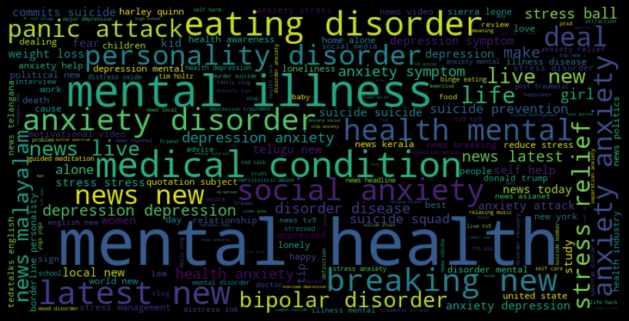

 Ever wondered how discussions around mental health on YouTube shape the platform’s content and channel landscape? In today's digital age, mental health has garnered paramount importance, and YouTube has emerged as a significant platform for individuals seeking information, support, and connection on this crucial topic. As we delve into our analysis, our goal is to explore whether mental health discussions are on the rise on YouTube, examining the trends, categories, and visual evolution of channels and videos to unveil the platform's changing landscape. 

# Mental health: trendy problem?

According article1, .. People tend to have more mental issues than ever. We think this situation also reflects on YouTube, resulting in more and more videos, and people start sharing more of this content ...

We tend to if this is true in the following

## Data

The data is YouNiverse, and

keyword filtering along with snow ball sampling to extract mental health videos,

some of our keywords used are: ...

We ask the title of the video to contain such keywords, and at least one of th description and tag should contain as well.

To further tailor to our video content, we really want to focus on the videos with the desired category, so we eliminate videos with category as follow...

Finally, during the process our snowball sampling, we witness some wrongly filtered content such as "monkey..", so we manually filter out these videos containing the bad keywords.

Finally, our filtered result can be displayed as a wordcloud figure, with many keywords ..



## time trend

Seems pretty good, now we can display the number and the ratio of the mental health videos uploaded per month from 2006 to 2019. 



[Interpretation]: 

Some of our keywords include: `"mental health`, `disorder`, `solitude`, `depress`, `stress`, `suicid`, etc.

