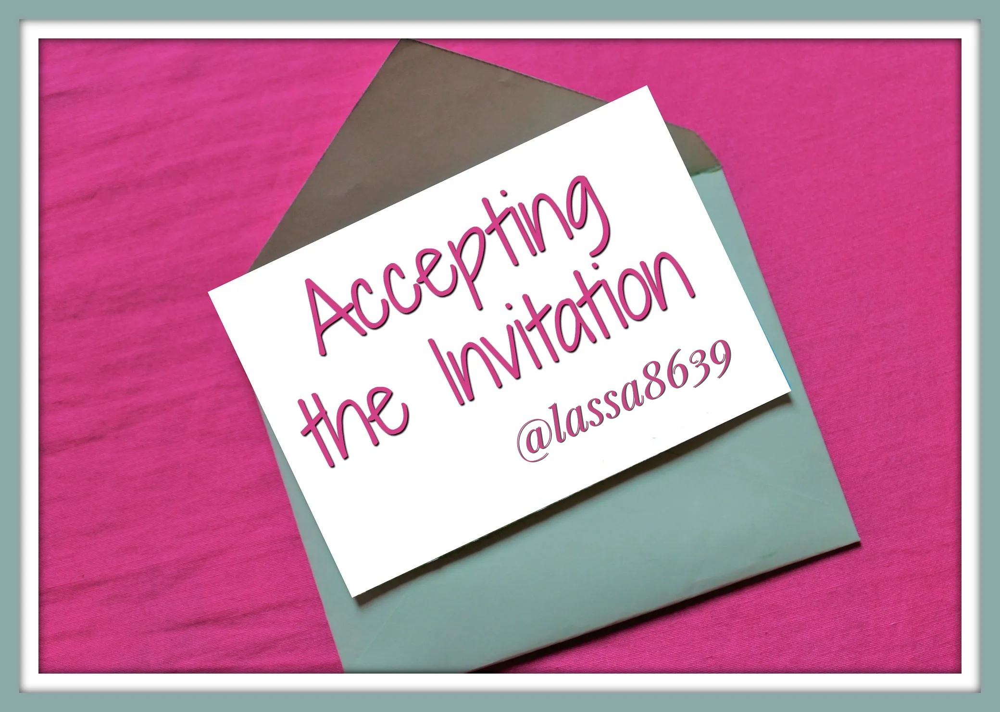
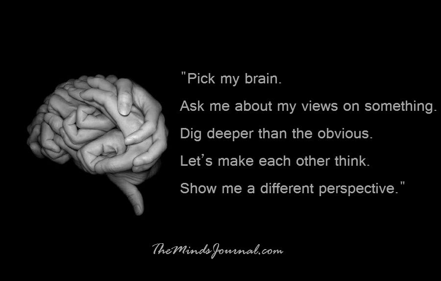

- Deadlines coming! Have you ever felt _stressful, anxious or even depressed_?

- Have you ever _posted your pressure on YouTube_, or simply seek guidance from _videos talking about mental problems_ on the platform? 

- Do you know there are growing amount of discussions about mental health on Youtube?

- What are they like? How many talk about them? How they influence today's channel content?

Follow our analysis and find out! Centered on the topic of mental health on YouTube, our main goal is to __look for the trend, track their contents and see the channels response toward it__. 

&nbsp;
# The Dataset We Used
We are using the dataset [YouNiverse](https://doi.org/10.5281/zenodo.46500463), a large collection of channel and video metadata from English-language YouTube presented by _Dr.Ribeiro_ and _Dr.West_. It comprises metadata for over 136k channels and 72.9M videos published between May 2005 and October 2019, as well as channel-level time-series data of weekly subscriber and view counts.  

&nbsp;
# Mental Health: is it trendy?
> RQ1: Is mental health a trend on YouTube?

`Mental Health` has never been a new topic: as early as the beginning of 21st Century, one in four adults in US suffered from mental illness -- that is nearly 60 million Americans in any given year _(Agency for Healthcare Research and Quality, 2009)_. However, not many of us paid serious attention to such problem. It all starts to change in September 2021, the year COVID-19 pandemic broke out, when things gets paticularly bad and the word mental health has become a publicly aware problem. According to the World Health Organization (WHO), because of the lockdown and economic setbacks, cases of anxiety and depression have `increased by 25%` globally, with suicide the second leading cause of death among 15-29-year-olds. Approximately `one in five people` in post-conflict settings have a mental health condition. 

**Is there a sign already showing the trend of mental health before the pandemic?** YouTube has been serving as a mirror reflecting people's life within a certain period. So we focus on the time from 2006 to 2019 to look for the answers.

<!-- We found many videos about mental health on Youtube even before the pandemic. Therefore, we would like to focus on the them to get the answers.  -->

## 1.1 How do we acquire target videos?

<!-- Before starting the analysis, we need to get videos about mental health first! At the same time, we plan to retrieve videoes of other topics so that comparison can be made between different trends to further validate our hypothesis. -->

Everything starts with data! How can we retrieve the desired mental health videos from millions of YouTube entries?

### 1.1.1 Snow ball sampling based on keywords

The retrievel method is based on the string matching of keywords. The idea is that:

1) We come up with a list of keywords  that is supposed to connect to the filed of mental health, including: `mental health`, `disorder`, `solitude`, `depress`, `stress`, `suicid`, etc. Particularly, we examine the three text columns of the metadata, namely `description`, `tags` and `title` and require **at least two out of three text fields** contain such a word in our designed word list, then we can assume that this video is relevent and be retrieved.

2) However, the initial keywords list may not be comprehensive. So it is necessary for us to look at the results and iteratively add new representative words to complete the list. The process is just like making a snowball! Here, some of the words we added include `sociopath`, `psycho`, etc.

Seems nice! However, after this step we print out the results and find many of retrieved videos seems irrelevant at all, such as _The Lego Batman Movie: Batman's Lonely Life_. It seems that it is only logical to perform a tighter filter and elinate the undesired records.

### 1.1.2 Filter based on video category and eliminate unnecessary keywords
Here comes the solution. We have done several additional filtering aiming for a more desired outcome.

<!-- 1) After retrieving, we check the results manually and see if there is any insightful words that occur in the result but is not included in our designed keyword list. If such word exists, we `iteratively add them to the list` and `repeat the process` 1-3 times to update the results until no new words can be found, just like snowball!   -->

- We addtional require that in the `title` of the video, at least one of keywords should exist, which is tighter than the `two out of three requirement` above.

- We eliminate some videos belonging to categories like `Music`, `Movie` since we inspect the content of the videos and most of them are false positive.

- Specifically for `mental health` videos, we filter some of the undesired contents based on keywords like `monkey`, `malone`, for they show little relevance to the topic.

Now lets see some of our samples:



Seems that there are still some noisy data included inside, but the majority of the videos are focusing on mental health now. Seems like a good result. Let's use a wordcloud figure to see their tags:

Great! Most of the tags are mental health related! Now the results are much more relevant and convincing 🎉, and we are ready to step into the next step! 

## 1.2 What does data say?

### 1.2.1 New videos

Numbers matter! -- We closely investigate how many videos about mental health are uploaded per month over the years to examine if there is a trend at all. In the plot, we display both the `absolute numbers` and `ratios with respect to all videos uploaded that month` throughout the year and applied `linear regression` to fit the data (after disgarding the fluctuating data from 2006-2009).  Hmmm, it seems there is a mild growing trend and we further look at the p-value of the LR analysis to make sure it is statistically significant. To this end, **we successfully conclude that there is a mild yet significant increase of the numbers and ratios regarding mental health videos.**



However, we do not want to immdediately jump to a conclusion without a proper comparison with other topics. Specificaly, we choose `gender equality` and `climate change`, the two other important social issues receiving growing attention, as our compared topics. We plot their respective ratio throughout the years and put it into the log scales for a clearer comparison. It is rather surprising to see that none of the other comparing trends shows a noticable increase for their ratios. And the **mental health videos out ranks both gender equality and climate change videos in upload number and increase rate**.

 

Maybe... We hypothesize that remaining a stable uploading ratio already means a sustained and consistent attention indicating it is one of the social trend. The upward trend doesn't show because the ranges of videos on YouTube are increasingly explored making the total numbers of videos rises comparably faster than videos from the specific topic.

### 1.2.2 Popular?
Numbers is not everything, what about the **POPULARITY** of the videos? Here, we define the popularity score as `popularity_score` = `view_count` + `like_count`, and let's compare the ratio of the popularity score with respect to the added popularity_score of the videos: A similar case -- with mental health videos showing a mild increasing trend and the comparing topics fluctuate throughout the years. Now, we are confident to say that  **there is a temper yet significant increase in monthly uploading mental health videos, suggesting its social importance and rising attention paid to the topic**. 



&nbsp;

# Characteristics: What it is talking?
> RQ2: Which topics predominate in the mental health category?

In this section ,we aim to delve deep inside the mental health videos and would like to study two problems:
1) What is the most `frequently mentioned group of people`?  
2) Among all the videos, what is the most `frequently mentioned mental issues`? Disorder or suicide, etc?
3) Finally, throughout the years, do the situation varies?

To do this, we divide the keywords into several groups to our best knowledge, and calculate their frequency according to their appearance in the mental health videos.

## 2.1 Which group of people?

We count the frequency of `man`, `woman`, `teenager` and `senior` appeared in our target videos.



And see that throughout all the years: 

As for **age**, mental issues regarding `teenager` remains the biggest problem. It is because adolescence is a unique and formative time. Physical, emotional and social changes, including exposure to poverty, abuse, or violence, can make adolescents vulnerable to mental health problems. (but there could be cofounders like the access to Internet, teenagers therefore get more attention).  

As for **gender**, `woman` is higher than men. There are many factors like biological makeup and experience in society that are thought to increase women’s vulnerability to mental health disorders.

From a biological standpoint, for example, due to their brain’s wiring, women report higher levels of empathy and emotional understanding than men. These qualities, while generally positive, are closely tied to worsening depression, anxiety, and trauma. Women also have different experiences than men, in general, women are constantly up against societal expectations and pressures that can negatively impact their mental health. For example, women place great importance on their physical appearance – largely because society tells them to do so. 

## 2.2 What's the biggest issue? 
Now, let's see the most mentioned category. 



And we can see `stress` is the most mentioned problem, followed by `suicide` and `depress`. They all show a similar trend of increase all these years.

## 2.3 How they intersect?

We apply a heatmap to closely examine the intersection between people and mental issues. Interestingly, `stress` is the most common issue shared across all groups of people. And teenagers are the most vulnerable group affected especially by `stress` and `suicide`. This is in align with the above anaysis separately and lay a paticular importance on educating teenagers properly for their mental well-beings.



# Positive or negative?
> RQ3: What is the common sentiment when people talk about mental health, and what does that reveil?

### 3.1 Sentiment of the videos

Let's examine the overall sentiment landscape of mental health videos. 

What do the sentiment scores, determined by the BERT model, reveal about these conversations? Are they more about delving into the complexities of mental health, or celebrating positive support and outcomes? 



As time progresses, we notice a shift towards negative sentiment. What does this shift signify? 

This evolving sentiment pattern might be a response to a growing demand for authenticity in mental health discussions, rather than mere trends. The consistent increase in negative sentiment over 14 years suggests a deeper, more meaningful change in how mental health is portrayed in digital media.

Now, let's consider how sentiment scores correlate with popularity score defined in 1.2.2. 



We have two interesting discoveries:

1. At the lower end of the popularity spectrum, there is a notable stability in sentiment, with a subtle decreasing trend overall.
2. As videos become more popular, their sentiment scores become more varied.

For the first observation, we can perform a linear regression analysis in the middle range. 



There is a discernible downward trend in the average sentiment score. This gradual decline could indicate that creators with a larger audience may feel a responsibility to present a more multifaceted and perhaps less idealized view of mental health.

For the second observation, this variability in top videos suggests that more popular videos tend to polarize opinion. Maybe, this pattern comes from 
1. genuine desire to contribute to the destigmatization of mental health issue?
2. a pursuit of popularity => trend-following? 

To understand what the popular videos are trying to deliver with such polarized sentiment score distributions, we may turn to topic detection analysis based on the LDA model.

## 3.2 Topic keywords of the videos

We focus on the top 500 videos with the highest popularity scores, analyzing their titles to grasp the core topics, as titles can concisely summarize the videos' themes comparing to the description parts with some irrelevant information like URL.



The analysis uncovers a range of topics. Let's try to categorize them and analyze them.

| Topic Numbers | Key Words Combined                                        | Combined Analysis                                                                                                                                                           |
|---------------|----------------------------------------------------------|----------------------------------------------------------------------------------------------------------------------------------------------------------------------------|
| 0, 1          | stories, real, eating, psychopath, psychological, hacks  | Focuses on personal narratives, real-life stories, and psychological insights, offering viewers relatable content that delves into personal experiences and mental phenomena. |
| 2, 4          | mixing, satisfying, bought, store, giant, mesh, meditation| Centers on activities and practices related to well-being, stress relief, and meditation, providing viewers with practical self-care methods.                                |
| 3, 5          | left, live, kids, bags, squish, old, open, puppy          | Appears to blend discussions on mental health with aspects of family life, learning, and aging, reflecting the pervasive nature of mental health across various life domains.|
| 6, 9          | open, school, supplies, sneak, psychology, vs, kids       | Likely involves educational content and psychological experiments, aiming to raise awareness about mental health issues, especially among younger audiences.                 |
| 7, 8          | psychological, super, illness, mental, old, brain         | Indicates a focus on more serious aspects of mental health, including illness, therapy, and psychological theories, addressing mental health issues in a substantive manner. |

Our findings show that **while there is some content that may follow viewing trends with lighter themes, a significant portion of mental health videos is committed to more profound topics**. The gradual shift towards a more sober tone in descriptions and the emergence of weightier topics in video titles both point towards a digital environment that is **increasingly reflective of the real societal dialogue on mental health**.

&nbsp;
# What does the Trend Bring?
> RQ4: Can we see an increase (or decrease) in performance (subscribers, views, likes, ...) for channels that speak about mental health?

> RQ5: Did old channels that were not speaking about mental health start more often to speak about it?

In the above part, we talk about the mental health videos on YouTube. 

Now, hold on for a while. The nature of the problem might depend on your perspecitve! Let's look at **how the target videos influence other videos and channels.**

&nbsp;
## 4.1  Performance: What brings to followers?

Until now, we try to identify the possible videos related mental health, how this category behaves with respect to others and which category of people is the most affected by mental health. But can we now take a look at the problem, from the youtuber point of view? How visualizations(views) and subscribers (subs) of a channel are affected after uploading a mental health video?
To answer this question, we can now make use of the behaviour of the `views` and `subs` of each channel over time. Particularly we have available a sampling of these two quantities for every week of every channel.
With this information, we can consider all the channels with at least one mental health video uploaded, and identify the week in which the channel has uploaded a video of this kind for the first time. By then studying the weekly gaining, i.e. `delta` in views and subs before and after this video, we can observe these two quantities for every channel and search for significant differences.



We can see the histograms of these two quantities: the gaining before the mental health video all over the channels, i.e. `delta_before`, and the gaining after the mental health video all over the channels, i.e. `delta_after`, using a logarithmic y axis. Already at first glimpse, we can understand that the histogram made by the delta views after the mental health video upload seems more shifted to the right, with respect to the increament of the week before the mental health video. Indeed, comparing these two with a t-test, the difference between the two histograms is `statistical significant`!
We can apply the same reasoning for subs, obtaining the following figure.



Here the two histograms look more similars one with respect to the other and in fact, performing again a t-test between them, there are no significant differences between one another.
These first results can be intepreted by thinking that the first mental health video uploaded by a channel can have contribuated with an abnormal gain in views for a week, but in general it has not shifted by that much, the equilibrium of the channel, by looking at the subscribers, a more stable source of information for identifying the success of a channel.
But in general we can dig more into these results. Focusing in particular on the views, we can try to find the mental health videos for which the gaining in views is more significant and then study in detail the time series of the channels for which this happens. We can for example filter the most important mental health video by taking just the one that gives a gain over a certain threashold. We can graphically see the different gaining for each channel, before and after the mental health video, highlighting the most significant ones, in the following figure.



By then considering the channels with the more significant gains, we can analyze them sigularly. By doing so we find out that these selected channels do not seem to be a good example for our study because, looking at their content, they do not even upload what we think to be mental health video, but are just probably errors that the filter of first section cannot detect. This can make us say that the statistical different in views does not seem to be so important to allow us to conclude that uploading a mental health video as a direct effect on the channel performance. But it opens up to then analyze the quantity of mental health channel, after the first upoload... (see next section)

&nbsp;
## 4.2  Followers?
We just conclude that when channels upload their first mental health video can statistically see a upnormal gain in visualization but this is not so strong to be analyzed singularly. Maybe we can take a step back, and analyze the `number` of mental health videos uploaded over time: if there is a positive trand of this, it can mean that either people demand for more mental health video by their favorite youtube, and so this is taken into account by increasing this number and eventually turn into a "mental health" channel.

<iframe width="560" height="315" src="https://www.youtube.com/watch?v=wC36qA9gVNA" title="YouTube video player" frameborder="0" allow="accelerometer; autoplay; clipboard-write; encrypted-media; gyroscope; picture-in-picture" allowfullscreen></iframe>

<!--  -->

In particular, by analizing the time series of the weekly change in views, we idenfied one significant channel really symbolic for the type of information we want to search for answering this question. This channel is "Sammy-Marie Grimm", that starts by posting videos about free-time and vlogs, and once in a while, it publishes a mental health related video, in which it gains a more significant amount of views with respect to its standards.



As we can see over time, the number of updated mental health video increases over time, in particular considering looking at chuncks of the total time period. In fact, considering the number of updated video in a time `windows of 10 weeks`, we obtain the following figure, for the same channel.



We can calculate for each channel this quantity and, throught a Mann-Kendall Trend Test, addressing if the number of mental health videos, uploaded in this time window, has an increasing trend over time. By then, throught a Fisher test, consider collectively all the p-values, we discover the overall we have an `increasing trend`! This is very significant because it means the in general, the identified channels talking about mental health will upload more video, given a local time span. This time span, with respect to the research done before for yearly uploading, wants to measure more locally if more videos about mental health, by channel, are uploaded and this seems to be the case!

